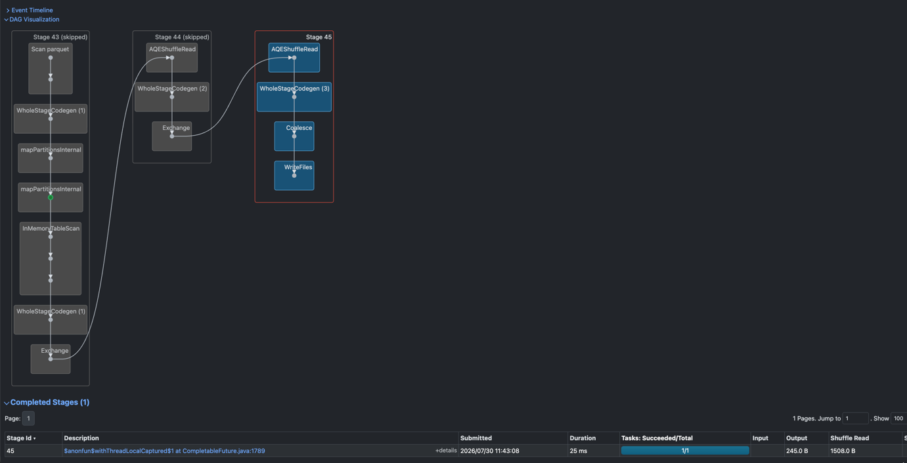

# NYC TLC Trip Data — Spark DataFrame/DAG Analysis Report

## 실행 환경
- PySpark 4.2.0, `local[4]` master
- venv: `softeer-DE-wiki/.venv` (Python 3.14)
- 데이터: `missions/W5/M1/data/yellow_tripdata_2026-05.parquet` 재사용 + TLC 공식 Taxi Zone Lookup CSV

## 파이프라인 단계
1. **로딩**: parquet(트립)/csv(zone lookup)를 스키마 추론으로 로드
2. **클리닝**: 필수 컬럼 null 제거 + `trip_duration_min`/`pickup_date`/`pickup_hour` 파생 + 이상치 필터링
   - raw row count: 4,090,836
   - cleaned row count: 3,021,419 (드롭 1,069,417건, 전체 대비 26.14%)
3. **캐싱**: 클리닝된 DataFrame을 `cache()` 후 `count()`로 materialize — 이후 4개의 갈래(다인승 필터,
   일별 집계, 시간대별 집계, borough join)가 모두 이 캐시를 재사용
4. **변환 3종**
   - Filtering: `passenger_count > 1` 다인승 트립 추출
   - Aggregation: 일별 트립수/평균거리/총매출, 시간대별 트립수
   - Join: zone lookup을 `broadcast()`로 조인해 borough별 집계 (셔플 스테이지 없음)
5. **액션 2종 이상**: 다인승 샘플 `collect()`, 결과 3종 `write`(parquet+csv)

## Lazy Evaluation 시연
`run.log`에서 발췌:
```
[action] raw row count = 4090836
[action] cleaned row count = 3021419 (dropped 1069417); cache materialized in this same pass
[lazy] transformations defined at 1785380876.203 -- no Spark job has run for these DataFrames yet
[lazy] daily_summary_df physical plan (explain() does not trigger a job):
[action] collect() called at 1785380876.219
[action] collect() returned at 1785380876.276, 20 rows
[action] write(daily_summary) called at 1785380876.276
[action] write(daily_summary) finished at 1785380877.027
[action] write(hourly_counts) called at 1785380877.027
[action] write(hourly_counts) finished at 1785380877.342
[action] write(borough_summary) called at 1785380877.342
[action] write(borough_summary) finished at 1785380877.877
```
변환(4번 단계) 코드는 위 로그의 `[lazy] transformations defined at 1785380876.203` 시점에 이미 다 작성되어
있었지만, 그 시점까지 어떤 Spark 잡도 실행되지 않았다 — `daily_summary_df.explain(mode="extended")`가 물리적
실행 계획(Parsed/Analyzed/Optimized/Physical Plan)을 출력하지만 이는 계획 확인일 뿐 잡을 트리거하지 않는다.
실제 잡은 그 다음 줄의 `collect()` 호출(1785380876.219)에서야 처음 발생했고, 이어서 `write()` 3회가 순차
실행됐다(마지막 borough_summary write가 1785380877.877에 종료). 즉 변환 정의 시점과 실제 실행 시점 사이에는
약 16ms의 간극이 있으며, 이 간극 동안 아무 Spark job도 돌지 않았다는 것이 타임스탬프로 확인된다. 또한
`[action] cleaned row count ...` 로그 한 줄에 "행 수 계산"과 "캐시 materialize"가 함께 표기된 것은,
`clean_trips(trips_df).cache()`로 캐시를 먼저 걸고 그 다음 `count()`를 단 한 번만 호출해 캐싱과 카운트를
같은 pass에서 끝냈기 때문이다(예전 코드는 캐시 이전에 한 번, 캐시 materialize를 위해 또 한 번, 총 두 번
전체 데이터를 스캔했다).

## DAG 및 스테이지 최적화


스크린샷은 세 결과 테이블 중 하나를 쓰는 write job의 DAG로, **Stage 43과 Stage 44가 "(skipped)"로 표시**되고
**Stage 45만 실제로 실행**된 것을 보여준다.
- **Stage 43 (skipped)**: `Scan parquet` → `WholeStageCodegen (1)` → `mapPartitionsInternal` →
  `mapPartitionsInternal` → `InMemoryTableScan` → `WholeStageCodegen (1)` → `Exchange`. 이는 원본 parquet을
  읽고 클리닝 필터/파생 컬럼을 계산해 캐시(`InMemoryRelation`)를 만드는 스테이지다.
- **Stage 44 (skipped)**: `AQEShuffleRead` → `WholeStageCodegen (2)` → `Exchange`. 집계를 위한 셔플
  스테이지다.
- **Stage 45 (실행됨)**: `AQEShuffleRead` → `WholeStageCodegen (3)` → `Coalesce` → `WriteFiles`. 최종 결과를
  파일로 쓰는 스테이지만 새로 실행됐다.

Spark UI는 어떤 스테이지의 셔플 출력이 같은 세션의 이전 잡에서 이미 계산되어 있으면 그 스테이지를
"skipped"로 표시한다. 이 스크린샷은 사실 **두 가지 서로 다른 최적화**가 겹쳐서 나타난 결과다.

첫째, Stage 45는 `AQEShuffleRead` → `WholeStageCodegen (3)` → `Coalesce` → `WriteFiles`로 구성되는데,
`Coalesce` 노드가 존재한다는 것은 이 스테이지가 `write_output_table`의 `df.coalesce(1).write...csv(...)`
호출(CSV 출력)에 해당함을 의미한다(parquet 쪽 write에는 `coalesce(1)`이 없다). 같은 `write_output_table`
호출 안에서 parquet write가 CSV write보다 밀리초 앞서 실행되며, 두 write는 동일한 결과 DataFrame을 쓰는
"형제(sibling) 잡"이다. 따라서 Stage 43(parquet 스캔 + 클리닝 필터 계산)과 Stage 44(집계를 위한 셔플)가
CSV write 잡에서 skipped로 뜨는 이유는, 바로 직전 parquet write 잡이 이미 동일한 셔플 맵 출력을 만들어
뒀기 때문이다 — 즉 이것은 **셔플 출력 재사용(shuffle-output reuse)**이며, `cleaned_df.cache()`의 직접적인
증거는 아니다.

둘째, `cleaned_df.cache()`가 실제로 효과를 내고 있다는 증거는 같은 스크린샷의 **다른 신호**에서 확인된다.
Stage 43 내부의 `InMemoryTableScan` 노드는 이 스테이지의 입력이 매번 parquet을 새로 읽는 대신 캐시된
`InMemoryRelation`에서 온다는 것을 보여주며, 그 바로 위 `mapPartitionsInternal` 노드에는 초록색 캐시
마커(cache marker)가 표시되어 있다(`report_assets/spark_ui_dag.png`에서 육안으로 확인 가능) — 이 마커는
해당 노드의 출력이 캐시로부터 제공되고 있음을 Spark UI가 명시적으로 표시하는 신호다. 캐싱이 없었다면
daily_summary/hourly_counts/borough_summary 3개 결과 테이블 각각의 parquet+CSV write 잡마다 매번 원본
parquet을 처음부터 다시 읽고 클리닝 필터를 재계산해야 했을 것이다.

정리하면, 이 스크린샷은 (1) 같은 `write_output_table` 호출 안에서 parquet write와 CSV write 사이의
셔플 출력 재사용, 그리고 (2) 그 셔플 입력 자체가 `cleaned_df.cache()`를 통해 제공되고 있다는 것, 이렇게
서로 다른 두 최적화를 함께 보여준다.

Broadcast Join(별도 최적화 포인트, 위 스크린샷과는 무관): `compute_borough_summary`(`main.py`)는 zone
lookup 테이블(약 265행의 작은 테이블)을 `F.broadcast(zone_lookup_df.select(...))`로 명시적으로 감싼 뒤
`cleaned_df`와 join한다. Sort-merge join이었다면 양쪽 테이블에 대한 셔플(Exchange) 스테이지가 필요했겠지만,
broadcast join은 작은 테이블을 각 executor에 통째로 복제해 보내므로 큰 테이블 쪽의 셔플이 필요 없다. 이
최적화는 스크린샷에 나온 스테이지들과는 별개로, 코드 자체(`F.broadcast()` 호출)에서 확인되는 것이다.

## 결과 요약
- 일별 요약 (daily_summary): 클리닝된 3,021,419건 중 2026-05-01 ~ 2026-05-29 사이 일별 트립수는 약
  57,554건(05-25, 최저)에서 120,092건(05-14, 최고) 사이로 분포하며, 일별 총 매출은 약 125만~252만 달러
  범위이다. 다만 `daily_summary` 테이블에는 명백한 데이터 품질 이상치 2건이 섞여 있다: `2009-01-01`(1건)과
  `2026-04-30`(11건)이다. 이는 원본 TLC parquet에 있던 잘못된 타임스탬프가 `clean_trips`의 필터(트립
  시간/거리/승객수/요금 임계값만 검사)를 통과해 남은 것으로, 파이프라인 버그라기보다는 원본 데이터의 알려진
  품질 이슈로 봐야 한다. (참고: `missions/W5/M1`의 RDD 버전은 날짜 범위를 명시적으로 검사해 이런 이상치를
  걸러냈지만, 이번 DataFrame 버전의 `clean_trips`는 날짜 범위 필터를 두지 않았다.) 또한 `show(31,
  truncate=False)`가 "only showing top 31 rows"로 출력을 잘랐기 때문에, 로그에는 2026-05-29까지만 보이고
  그 이후 날짜(5월 말)의 행은 실제 출력에 포함되지 않았다.
- 피크아워 (hourly_counts): 트립이 가장 많은 시간대 상위 3개는 18시(215,728건), 17시(213,495건),
  16시(197,298건)이다. 반대로 가장 한산한 시간대는 4시(14,913건)였다. 전반적으로 오전 4시를 저점으로 저녁
  17~18시 퇴근 시간대까지 꾸준히 증가하는 패턴을 보인다.
- Borough별 집계 (borough_summary): Manhattan이 2,636,872건으로 압도적 1위이며 평균 요금은
  $16.16이다. 2위는 Queens로 290,575건, 평균 요금 $53.82(공항 픽업이 많아 평균 요금이 높은 것으로 추정).
  3위는 Brooklyn으로 66,200건, 평균 요금 $30.29이다. 그 외 Bronx(22,684건, $36.77),
  Unknown(4,146건, $26.66), N/A(738건, $79.25), EWR(112건, $100.41), Staten Island(92건, $29.79) 순이다.
