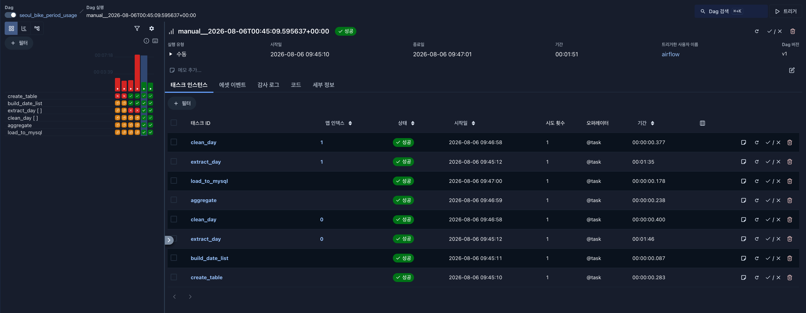

# Seoul Public Bike 2-Day Station Usage ETL (Airflow)

서울 열린데이터광장 `tbCycleRentUseDayInfo` API에서 2026-06-27, 2026-06-28 2일치 데이터를
단일 Airflow DAG run에서 수집·정제·집계하여 MySQL `station_period_usage` 테이블에
멱등적으로 적재하는 파이프라인입니다.

## 폴더 구조

- `dags/seoul_bike_period_usage.py` — Airflow DAG 정의
- `src/seoul_bike_etl/` — API 클라이언트, 정제, 집계, 설정 모듈
- `sql/` — 테이블 생성 DDL, 제출용 최종 결과 조회 쿼리
- `tests/test_project_contract.py` — 계약(contract) 검증 (전체 로직 커버리지 목적 아님)
- `data/{raw,processed,rejected}/` — 단계별 중간 산출물(날짜 키로 덮어쓰기, 멱등)
- `screenshots/` — DAG 성공 실행 스크린샷 제출용

## 1. 사전 준비

1. Docker, Docker Compose 설치
2. 서울 열린데이터광장에서 `tbCycleRentUseDayInfo` 사용 인증키 발급
3. `.env` 파일 생성:

```bash
cp .env.example .env
# .env를 열어 SEOUL_API_KEY, MYSQL_* 값을 실제 값으로 채운다
```

## 2. 실행

```bash
docker compose up --build -d
```

- Airflow UI: http://localhost:8080 (Airflow 3.x 기본 Simple Auth Manager 계정: `admin` / `admin`.
  로그인이 안 되면 `docker compose logs airflow-api-server | grep -i password`로 자동 생성된
  비밀번호를 확인한다.)
- MySQL: `localhost:3307` (컨테이너 내부에서는 `mysql:3306`)

DAG `seoul_bike_period_usage`를 Airflow UI에서 Unpause 후 "Trigger DAG"로 실행합니다.
기본 파라미터(`start_date=2026-06-27`, `end_date=2026-06-28`)만으로 두 날짜가 하나의
DAG run에서 모두 처리됩니다.

이 파이프라인은 **정확히 연속된 2일(`end_date`가 `start_date`의 다음 날)로 이루어진
기간만** 지원합니다. "Trigger DAG w/ config"에서 `start_date`/`end_date`를 바꿔 다른
연속된 2일을 돌릴 수는 있지만, `start_date == end_date`(같은 날짜)이거나 3일 이상
걸치는 범위(예: `start_date`와 `end_date`가 2일 이상 떨어짐)는 지원하지 않으며,
`aggregate` task가 즉시 `AirflowException`을 발생시키며 명확히 실패합니다.

CLI로 트리거하려면:

```bash
docker compose exec airflow-scheduler airflow dags trigger seoul_bike_period_usage
```

## 3. 데이터 클렌징 규칙

원본 API는 스테이션 식별/명칭 필드를 `RENT_ID`/`RENT_NM`으로 반환합니다. `cleaner.py`가
이 두 필드를 검증한 뒤 내부 계약 필드명인 `RENT_STATN_ID`/`RENT_STATN_NM`으로 번역하며,
이후 단계(aggregator, MySQL 적재 등)는 항상 `RENT_STATN_ID`/`RENT_STATN_NM`을 사용합니다.

다음 조건에 해당하는 행은 **전부 제외**하고, 제외된 행은 사유(`reason`)와 함께
`data/rejected/{date}.json`에 별도 저장합니다.

| 사유(`reason`) | 조건(원본 API 필드 기준) |
|---|---|
| `missing_station_id` | `RENT_ID`가 null 또는 빈 문자열 |
| `missing_station_name` | `RENT_NM`이 null 또는 빈 문자열 |
| `non_numeric_use_cnt` / `non_numeric_move_meter` / `non_numeric_move_time` | 해당 컬럼이 숫자로 변환 불가 |
| `negative_use_cnt` / `negative_move_meter` / `negative_move_time` | 해당 컬럼 값이 음수 |

정제 전/후 건수와 제외 비율은 `clean_day` task 로그에 남습니다. 제외 비율이 20%를
초과하면 WARNING 로그를 남기되 파이프라인은 계속 진행하고, 정제 후 남은 레코드가
0건이면 치명적 오류로 간주해 task를 실패시킵니다.

## 4. 멱등성

- 원본/정제 결과 파일은 `data/{raw,processed,rejected}/{date}.json`처럼 **날짜를 파일명으로
  사용**해 재실행 시 항상 덮어씁니다.
- MySQL 적재는 대상 기간(`period_start_date`, `period_end_date`)에 해당하는 기존 행을
  **DELETE 후 INSERT**하는 트랜잭션으로 처리합니다. 따라서 동일 기간을 여러 번 재실행해도
  중복되거나 충돌하는 행이 생기지 않습니다.

## 5. 데이터 품질(DQ) 체크

| 단계 | 체크 항목 | 기준 초과 시 |
|---|---|---|
| 수집(`extract_day`) | 응답 스키마 컬럼 일치, 0건 수집 여부 | 치명적 → task 실패 / 경미 → WARNING |
| 정제(`clean_day`) | 정제 전/후 건수, 제외율 | 전량 제외 → task 실패 / 제외율 20% 초과 → WARNING |
| 집계(`aggregate`) | station_id 중복 여부 | 중복 발견 → task 실패 |

## 6. 최종 결과 조회

```bash
source .env
docker compose exec mysql mysql -u"$MYSQL_USER" -p"$MYSQL_PASSWORD" "$MYSQL_DATABASE" \
  < sql/final_result.sql
```

## 7. 테스트

```bash
pip install -r requirements-dev.txt -r requirements.txt
pytest tests/ -v
```

## 8. DAG 성공 실행 스크린샷

실제 서울 열린데이터광장 API 키로 2026-06-27~2026-06-28 기간을 실행한 결과입니다. 모든 태스크
(`create_table`, `build_date_list`, `extract_day`×2, `clean_day`×2, `aggregate`, `load_to_mysql`)가
성공(초록색)했고, 최종적으로 2,738개 스테이션이 중복 없이 적재되었습니다.


